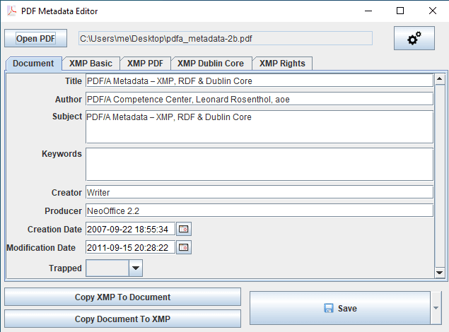
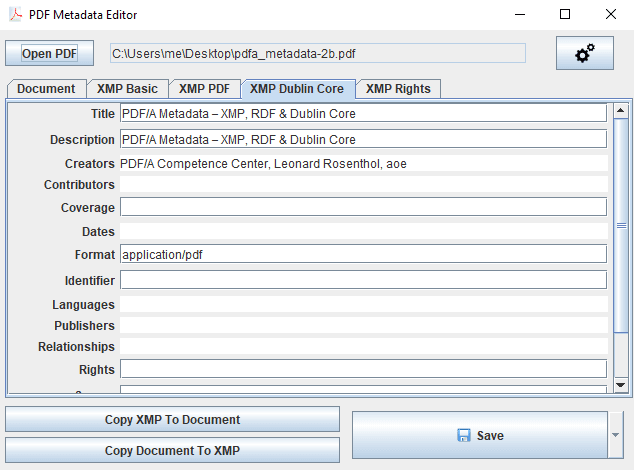
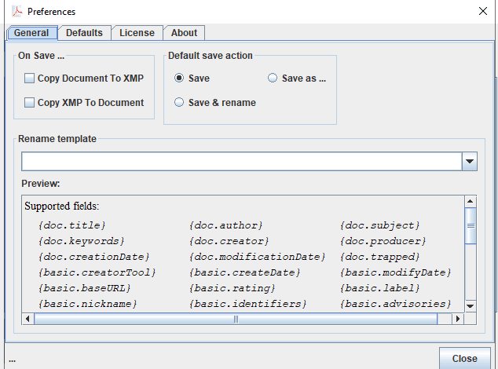

# PDF Metadata Editor

A simple, cross-platform desktop application for viewing and editing PDF metadata.

## Screenshots

| Document | XMP Dublin Core | Preferences |
|---------|---------|---------|
|  |  |  |

## About The Project

PDF Metadata Editor is a user-friendly graphical tool designed to make editing PDF metadata quick and easy. Built with Java and powered by the robust [Apache PDFBox](https://pdfbox.apache.org/) library, it provides a straightforward interface to modify essential information within your PDF files.

PDF metadata includes details about a file, such as its Title, Author, and Subject. This information is used by search engines and document management systems to index and categorize files. You might want to edit metadata to:

*   Correct or add missing information.
*   Remove sensitive or personal data.
*   Improve search engine optimization (SEO) for PDFs shared online.

## Features

*   **View and Edit Core Fields:** Modify the most important metadata fields, including:
    *   Title
    *   Author
    *   Subject
    *   Keywords
    *   Creator & Producer
    *   Creation & Modification Dates
*   **Cross-Platform:** Runs on any operating system with Java support, including Windows, macOS, and Linux.
*   **Simple Interface:** An intuitive GUI that requires no learning curve.
*   **Lightweight:** A small and efficient tool for a very specific job.

## Getting Started

Follow these instructions to get a copy of the project up and running on your local machine.

### Prerequisites

To run the application, you need to have Java installed on your system.
*   Java Runtime Environment (JRE) 8 or higher.

### Installation

#### Pre-built Binaries
You can download the latest pre-built installer or executable for your operating system from the [official website](https://pdf.metadata.care/) or the [GitHub Releases](https://github.com/zaro/pdf-metadata-editor/releases) page.

#### Arch Linux (AUR)
Arch Linux users can install the package from the AUR.
```sh
yay -S pdf-metadata-editor-bin
```

## Usage

1.  Launch the application.
2.  Click "Open" and select the PDF file you want to edit.
3.  The current metadata will be loaded into the form fields.
4.  Modify the fields you want to change.
5.  Click "Save" to apply the changes to the file.

## Building from Source

If you want to build the project yourself, you'll need [Apache Maven](https://maven.apache.org/) and a JDK (Java Development Kit) 8 or higher.

1.  Clone the repository:
    ```sh
    git clone https://github.com/zaro/pdf-metadata-editor.git
    cd pdf-metadata-editor
    ```
2.  Build the project using Maven:
    ```sh
    mvn install
    ```
3.  The final JAR file will be located in the `target` directory.

## Help

For more information and frequently asked questions, please visit the [Help Page](https://pdf.metadata.care/help/).

## Roadmap

See the [TODO.md](TODO.md) file for a list of proposed features and known issues.

## License

Distributed under the MIT License. See the [LICENSE](LICENSE) file for more information.
